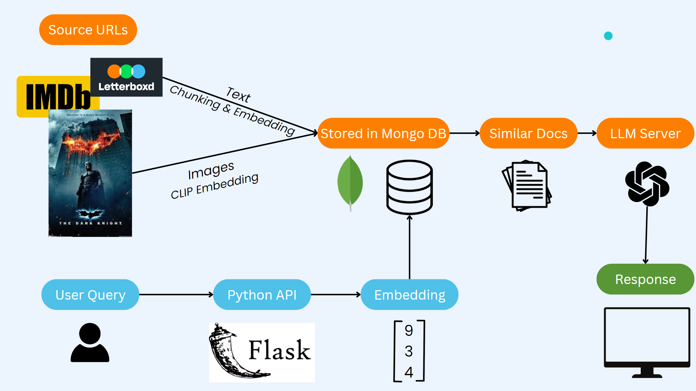
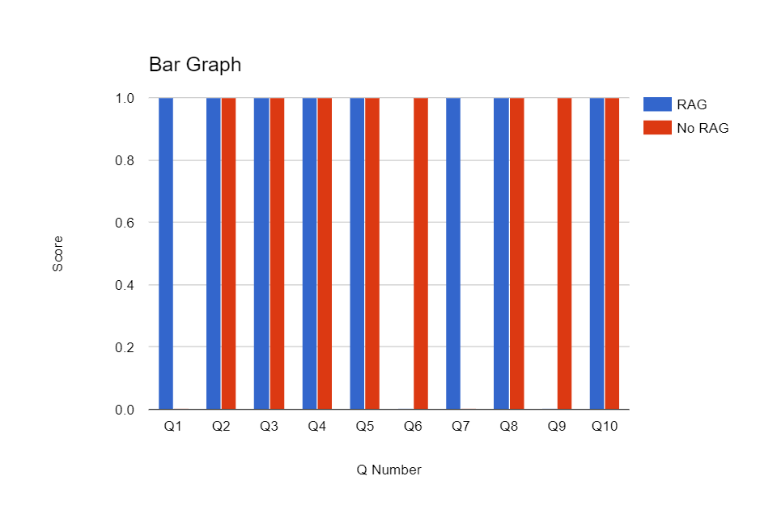
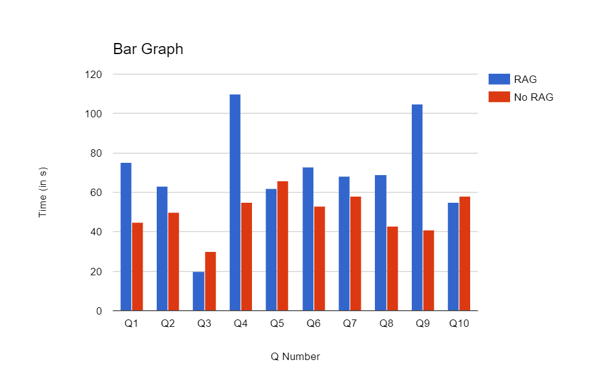
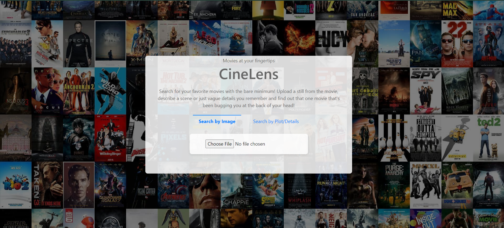

[](https://github.com/suneel-nadipalli/cinelens/actions/workflows/docker-image.yml)

# Cinelens

## Overview

Cinlenes is an intelligent movie search engine designed to help users find that one movie they can't quite seem to remember. Using what little information about the movie the user has in mind, either a still from the image or a vague description of the plot, Cinelens will search through its database to provide the 5 movies it thinks are closest to what the user asked for.

This project uses a Retrieval Augmented Generation (RAG) System in tandem with an Open Source LLM from Mozilla to determine the search results. Cinelens is equipped with information about the movies from websites such as Letterboxd, IMDB, Wikipedia, and more; to give it as much information as possible about each movie to ensure the most accurate responses.

## Demo

Link to the demo of the application: https://youtu.be/5fB28WlIX7Q

## Architecture

The system architecture is as follows:
- Required URLs are sourced to provide the bot with relevant information about the movies
- Text is extracted from these URLs and chunked into various sects
- These chunks are then stored in a Cloud Mongo DB
- Along with text data, images (stills) from these websites are also extracted and embedded via OpenAI embeddings, also in the same Mongo DB
- When the user uploads an image, the image along with the phrase "What movie is this from" are embedded together and a similarity search is performed against existing images in the DB
- The top 5 images from different movies are selected based on similarity score
- When the user uses text to describe the movie, embeddings are generated for the text and search against the stored chunks in the DB.
- The top 3 most similar chunks are given as context along with the query to the LLM and a response is returned

The following diagram visualizes the above process for a clearer picture:



## Evaluation

For the purposes of evaluation, a set of Gold Truth question-answer pairs was prepared and tested against. The final LLM was evaluated against these question-answer pairs with and without RAG to test the effectiveness of the same.

The evaluation was done on two grounds: speed, quality of response.

Speed was recorded as the time the LLM took to respond to the user's query.

Quality of response was rather simple, given the unconventional use of RAG in this application: the query was a vague description of a movie within the database, and the response was the actual movie title. If among the LLM's response the movie was mentioned, the score was recorded as 1. Else, it was noted to be 0.





## Instructions for Setup, Running, and Testing Application 

### Setting up the Application

Download the [Rocket-3B](https://huggingface.co/Mozilla/rocket-3B-llamafile/resolve/main/rocket-3b.Q5_K_M.llamafile?download=true) llamafile from the Mozilla Ocho Repository: https://github.com/Mozilla-Ocho/llamafile

Also, navigate to the api folder and create a new file called ".env.local". This will need to contain an environment variable under the name OPENAI_API_KEY, an OpenAI API of your own.

Once you have downloaded the llamafile, run the following command in your terminal to grant permission for your computer to run the model (only need to do this once) 

```
chmod +x rocket-3b.Q5_K_M.llamafile
```

Clone this repository into your local machine. Navigate to any directory and run the following comand to clone the repo:
   
```
git clone https://github.com/suneel-nadipalli/cinelens.git
```

### Running the Application 

Start the llamafile server (must be done everytime): 

```
./rocket-3b.Q5_K_M.llamafile
```

Navigate to the ai folder

Create a virtual environment by running: 

```
python3 -m venv venv
```

Activate the virtual environment by running: 

```
source venv/bin/activate
```

Install dependencies by running 

```
pip3 install -r requirements.txt
```
Navigate to the ui folder

Install dependencies by running 

```
npm install
``` 

Build the docker images for both the frontend and the backend by navigating to their respective directories (api & ui): 

ui:

```
docker build -t cinelens-ui -f Dockerfile .
```

api:

```
docker build -t cinelens-api -f Dockerfile .
```

After the docker images have been created, run the following:  

```
docker run -p 5050:5050 cinelens-api
docker run -p 3000:3000 cinelens-ui
```  
The frontend/UI should now be available at http://localhost:3000



Alternatively, the following can also be done to start the application:
- Navigate to the ai folder
- Activate (& create if needed) a virtual environment
- Install dependencies
- Run python app.py
- Navigate to the ui folder
- Run npm start

### Testing the Application 

Navigate to the ai folder

Activate the virtual environment by running 

```
source venv/bin/activate
```

To test the database connection, embedding function, image similarity search, third-party API access and other core functionality, navigate to the /tests folder within the api folder and run the following:

```
pytest
```

The command line should then display a message indicating that all tests (10/10) have passed

The command line should then display a message indicating that all tests (10/10) have passed
